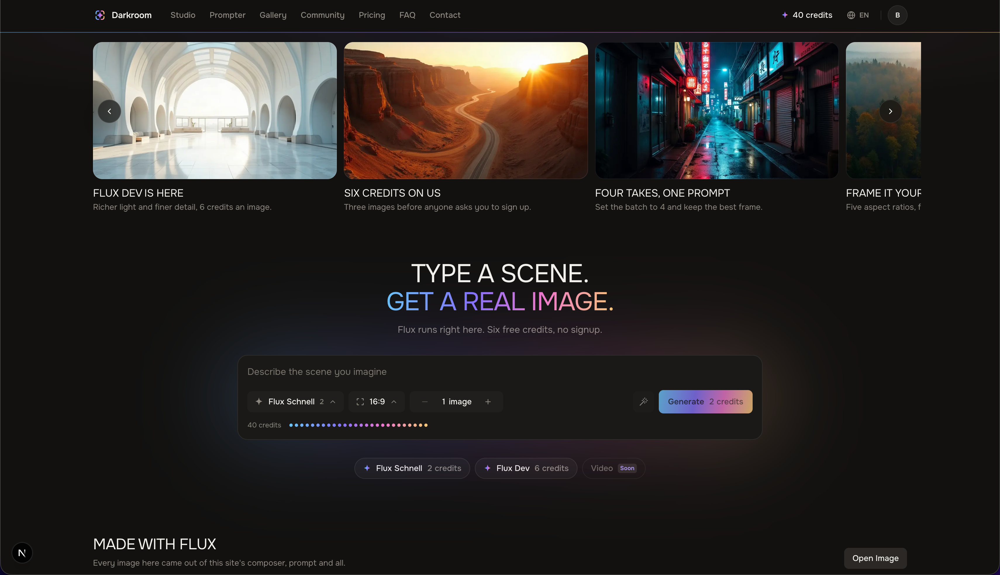
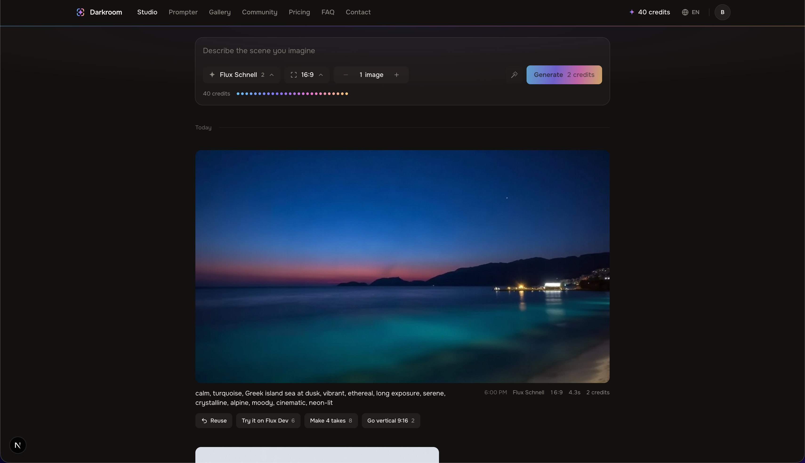
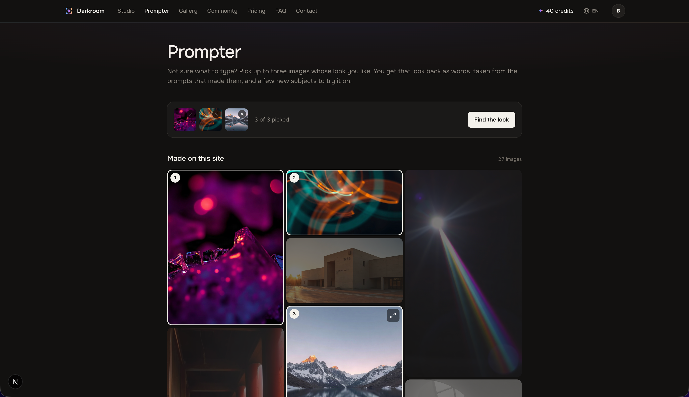
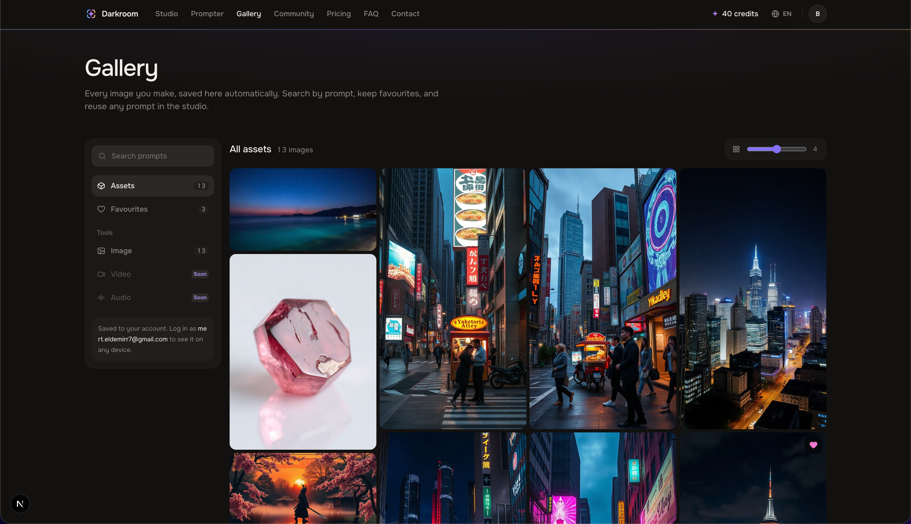
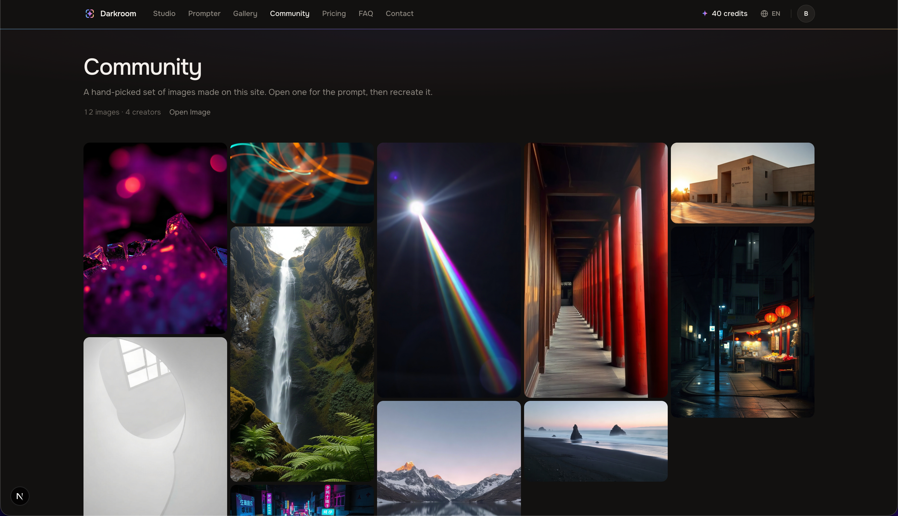
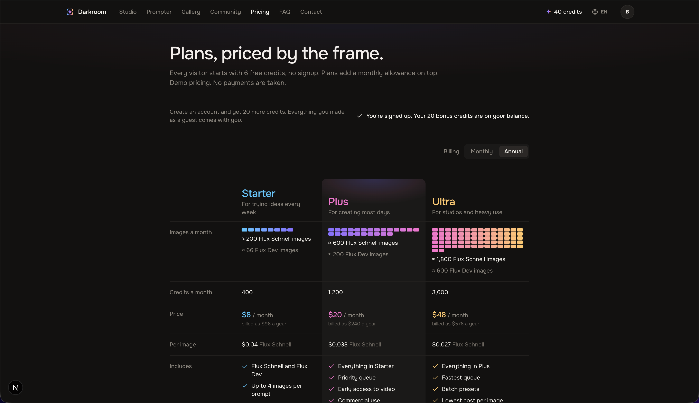
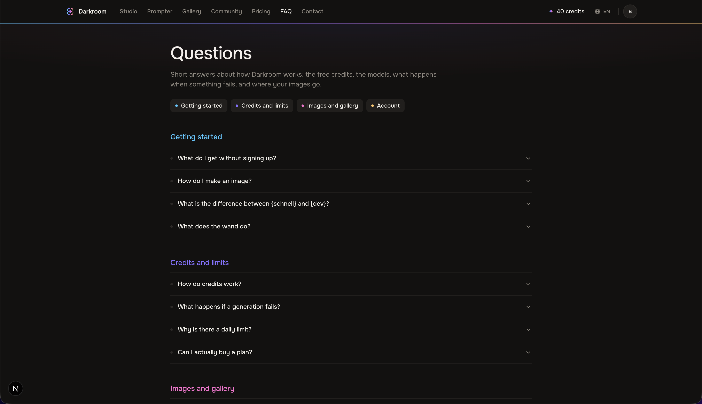
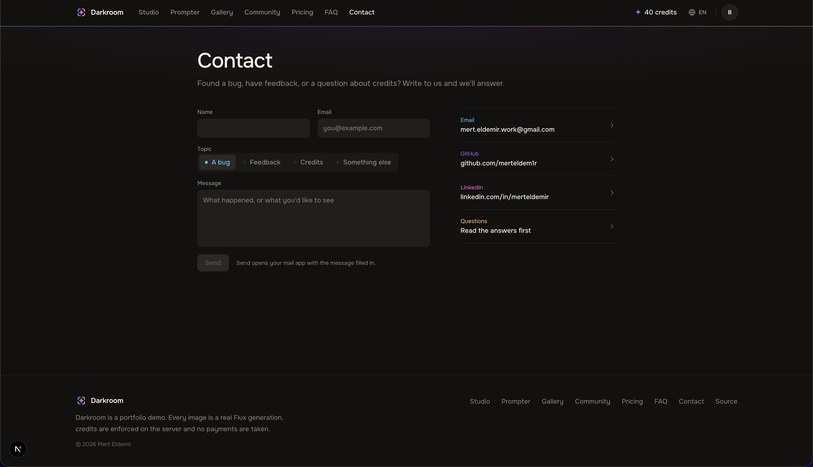

# Darkroom AI


Darkroom AI is a working clone of higgsfield.ai's image generation product, built as a 10-12 hour take-home.
Next.js 16 on Vercel, Supabase for auth, Postgres and Storage, fal.ai for the models.
Structure and dark UI follow the original; the palette, logo and every image are my own.

**Live:** [Darkroom AI by Mert Eldemir](https://hf-studio-8x.vercel.app/)

> **The core loop actually works.** A visitor types a prompt and gets a real AI image with no signup, and credits are enforced server-side in Postgres, so nothing the browser does can bypass them.

<table>
  <tr>
    <td width="50%"></td>
    <td width="50%"></td>
  </tr>
  <tr>
    <td align="center"><b>Explore</b> · type a scene and generate from the home page</td>
    <td align="center"><b>Studio</b> · composer on top, every run a frame with its real cost</td>
  </tr>
  <tr>
    <td width="50%"></td>
    <td width="50%"></td>
  </tr>
  <tr>
    <td align="center"><b>Prompter</b> · pick up to three images, get their look back as words</td>
    <td align="center"><b>Gallery</b> · your images, favourites and prompt search</td>
  </tr>
  <tr>
    <td width="50%"></td>
    <td width="50%"></td>
  </tr>
  <tr>
    <td align="center"><b>Community</b> · curated feed; open any image and recreate it</td>
    <td align="center"><b>Pricing</b> · three plans priced per image; UI only, no payments</td>
  </tr>
  <tr>
    <td width="50%"></td>
    <td width="50%"></td>
  </tr>
  <tr>
    <td align="center"><b>FAQ</b> · short answers on credits, models and failures</td>
    <td align="center"><b>Contact</b> · a mail-app form and direct links</td>
  </tr>
</table>

| | | |
|---|---|---|
| [Real vs UI-only](#whats-real-vs-whats-ui-only) | [Architecture](#architecture) | [Credits](#credits-and-why-they-cant-be-bypassed) |
| [Auth](#auth) | [Prompt help](#prompt-help-the-wand-and-the-prompter) | [Data model](#data-model) |
| [Stack](#stack) | [Project structure](#project-structure) | [Running locally](#running-it-locally) |

---

## What's real vs what's UI-only

| Feature | Status | Notes |
|---|---|---|
| Image generation | **Real** | Flux Schnell (2 credits) and Flux Dev (6) via fal; 5 aspect ratios, batches of 1–4 |
| Server-side credits | **Real** | Atomic spend, refund on failure, per-IP daily cap, global dollar budget |
| Anonymous auth + email sign-up | **Real** | Guest session on the first Generate; sign-up upgrades the same user and adds 20 credits once |
| Gallery (`/assets`) | **Real** | Your images under RLS: favourites, prompt search, grid-size slider, download |
| Community | **Real** | Hand-featured generations, read server-side with whitelisted fields |
| Prompt help | **Real** | The wand rewrites a rough idea; the Prompter turns picked images into a look and subjects. Free, per-IP capped |
| i18n | **Real** | English, Turkish, Russian; cookie-selected dictionaries, no library |
| Pricing, FAQ, Contact | UI / static | No payments are taken; Contact opens your mail app |
| Video, social sign-in | UI-only | Video shows as "Soon"; Google is shown disabled |

---

## Architecture

```
 Browser                      Next.js (Vercel)                 Supabase Postgres          fal.ai
 ───────                      ────────────────                 ─────────────────          ──────
 click Generate
   │ pending frame shows now
   │ ensureSession()  ───────────────────────────────────────▶ anonymous user
   │                                                           + profile, 6 credits (trigger)
   ▼
 POST /api/generate ─────────▶ getUser() verifies the JWT
                               validate prompt/model/aspect/batch
                               start_generation(...) ────────▶ lock budget row
                                                               check global + per-IP caps
                                                               UPDATE credits WHERE >= cost
                                                               insert pending generation
                                                               + ledger 'spend' row
                               generateImages() ─────────────────────────────────────────▶ Flux
                               download each image ◀───────────────────────────────────── URLs
                               upload to Storage ────────────▶ generations/{user}/{gen}/{i}.jpg
                               complete_generation(...) ─────▶ insert assets, mark succeeded
 images render ◀────────────── { credits, images[] }

 on any failure after the spend:  fail_generation(...) ──────▶ mark failed, refund once
```

The browser holds an anonymous Supabase session, reads only its own rows and calls Route Handlers. Everything that costs money happens in a Route Handler and inside Postgres functions.

- **Route Handlers, not Server Actions.** `POST /api/generate` can be hit with `curl`, which is how the concurrency and bypass tests run.
- **fal is server-only.** `FAL_KEY` is read in one `server-only` module (`src/lib/fal.ts`). There's no client proxy, so nothing can skip the credit check.
- **Outputs are copied to Storage** before the generation is marked complete. fal URLs expire and the gallery can't.
- **Handoffs between pages use `sessionStorage`, never the URL.** A "draft" only fills the composer; only a click on Generate spends.

---

## Credits, and why they can't be bypassed

Credits change only inside Postgres functions that only the server can call. The check and the decrement are one row update, so there's no read-then-write race:

```sql
update public.profiles
   set credits = credits - p_cost_credits
 where id = p_user_id
   and credits >= p_cost_credits
returning credits into v_credits;
```

| Layer | What it does |
|---|---|
| **`SECURITY DEFINER` functions** | `start_generation`, `complete_generation`, `fail_generation`, `set_favourite`, `grant_upgrade_bonus`, `start_prompt_improvement`: one transaction each, `search_path = ''`. |
| **`EXECUTE` revoked** | From `public`, `anon` and `authenticated`; granted only to `service_role`. The `user_id` comes from `auth.getUser()`, never the request body. |
| **Idempotent refunds** | `credit_ledger` has `unique (generation_id, reason)`, and `fail_generation` only acts on a `pending` row. A generation still pending after 3 minutes is refunded on the user's next call. |
| **RLS on every table** | `SELECT` where `auth.uid() = user_id`; no write policies at all. Anonymous users get the `authenticated` role, so policies are scoped to the user, never the role. |
| **Per-IP daily cap** | 30 images per IP per UTC day (`IP_DAILY_LIMIT`), counted under the same lock. IPs are stored as an HMAC; IPv6 is bucketed per /64. |
| **Global budget** | A singleton `app_budget` row: $5 a day, $9 total. A request that would cross either gets `GLOBAL_CAP` before any credit moves. |
| **Prepaid fal balance** | The hard ceiling behind all of the above. |

Model costs live in `src/lib/credits.ts`, imported by both the Generate button and the route, so the shown price and the charged price can't disagree.

**Tests.** `scripts/test-credits.mts` runs 46 checks against a dev server and the real database. They include 10 parallel requests on a 2-credit balance (exactly one succeeds), a forced fal failure that refunds exactly once, the per-IP cap under concurrency, and forged bearers plus direct RPC calls getting `401` / `42501`.

```bash
npm run dev            # one terminal
npm run test:credits   # another; ~$0.018 of real fal calls
```

---

## Auth

- **Anonymous first.** The session is created lazily on the first Generate, so crawlers never create users. The pending frame shows before sign-in resolves.
- **Sign-up upgrades in place.** `supabase.auth.updateUser({ email, password })` on the anonymous session keeps the same `user_id`, so the gallery carries over with no merge step.
- **The bonus is paid once.** `POST /api/account/upgrade-bonus` calls `grant_upgrade_bonus`, which checks `auth.users` for a confirmed, non-anonymous user. A partial unique index on the ledger stops a second payment.

---

## Prompt help: the wand and the Prompter

Both are free text calls to Llama 3.1 8B through fal's `openrouter/router`. They share one allowance of 20 per network per day through `start_prompt_improvement`, and no credits are involved.

- **The wand** (`POST /api/improve-prompt`) rewrites a rough idea in the composer into a detailed prompt, with Undo.
- **The Prompter** (`POST /api/prompter`) is for visitors with no idea yet. They pick 1–3 of this site's images, and the server resolves the ids to the exact prompts that made them (featured or showcase only, never free text). The model returns the shared look as short phrases plus three new subjects. The server drops any phrase it can't trace back to a picked prompt. The visitor switches phrases on and off, then opens one in the studio with the subject pre-selected.

---

## Data model

| Table | Role |
|---|---|
| `profiles` | One per auth user: handle and the **current balance** (`check (credits >= 0)`). Created by a trigger with 6 credits. |
| `generations` | One per Generate: prompt, model, aspect, batch, cost, estimated USD, status, hashed IP, `featured`. |
| `assets` | One per stored image: Storage path, size, `favourite`. A batch of 4 is one generation, four assets. |
| `credit_ledger` | Append-only history: `grant`, `spend`, `refund`, `upgrade_bonus`. Its unique keys make double refunds and bonuses impossible, and the tests assert it sums to the balance. |
| `app_budget` | Singleton: total and daily estimated spend against their caps. |
| `prompt_improvements` | One row per wand or Prompter call; exists only to count the per-IP allowance. |

---

## Stack

| Piece | Role |
|---|---|
| **Next.js 16** (App Router, Turbopack, React 19) | Server Components by default, Route Handlers for everything that moves money, `server-only` modules for secrets |
| **Supabase** | Anonymous auth, Postgres (credit logic in SQL functions, no ORM) and Storage |
| **fal.ai** | Flux Schnell / Flux Dev for images; Llama 3.1 8B for prompt help. Synchronous calls |
| **Tailwind CSS 4** | Tokens once in `@theme` (`globals.css`); no component library |
| **Vercel** | Hosting; its edge sets `x-real-ip`, which the per-IP cap relies on |

Six runtime dependencies: `next`, `react`, `react-dom`, `@supabase/ssr`, `@supabase/supabase-js`, `@fal-ai/client`. CI runs lint, typecheck and build on `main` and on pull requests.

---

## Project structure

```
src/
├── app/
│   ├── api/
│   │   ├── generate/               auth → start_generation → fal → Storage → complete
│   │   ├── improve-prompt/         auth → per-IP allowance → LLM rewrite
│   │   ├── prompter/               auth → picks resolved to our prompts → allowance → LLM
│   │   ├── assets/[id]/favourite/  auth → set_favourite
│   │   └── account/upgrade-bonus/  auth → grant_upgrade_bonus (idempotent)
│   ├── _home/        Explore: carousel, hero composer, presets, showcase
│   ├── image/        the studio: composer on top, runs as frames newest-first
│   ├── prompter/     pick images → look + subjects → draft to the studio
│   ├── assets/       the gallery (RLS-scoped reads)
│   ├── community/    featured feed, read server-side
│   └── pricing/ faq/ contact/
├── components/       cross-route: nav, credits pill, auth modal, lightbox, toast, composer/
└── lib/
    ├── credits.ts    model costs, limits, aspects (UI and API)
    ├── fal.ts        server-only; every fal call
    ├── ip.ts         server-only; caller IP → /64 bucket → salted HMAC
    ├── i18n/         en / tr / ru
    └── supabase/     browser client + session; server-only admin client
supabase/migrations/  schema, RLS, credit functions, applied in order
scripts/              the credit and abuse test suite
docs/                 PLAN.md (scope, credit rules), DESIGN.md (tokens, states, motion)
```

---

## Running it locally

```bash
git clone https://github.com/merteldem1r/higgsfield-ai-clone.git
cd higgsfield-ai-clone
npm install
cp .env.example .env.local
npm run dev   # http://localhost:3000
```

| Variable | Scope | Purpose |
|---|---|---|
| `NEXT_PUBLIC_SUPABASE_URL` / `NEXT_PUBLIC_SUPABASE_ANON_KEY` | Public | Project URL and publishable key (own rows only) |
| `SUPABASE_SERVICE_ROLE_KEY` | **Server-only** | The only key allowed to call the credit functions |
| `FAL_KEY` | **Server-only** | Read only in `src/lib/fal.ts` |
| `IP_HASH_SALT` | **Server-only** | HMAC salt for caller IPs (`openssl rand -hex 32`) |
| `IP_DAILY_LIMIT` | **Server-only** | Images per IP per UTC day; default 30 |

Run `supabase/migrations/` in filename order in the SQL editor. The first migration creates the `generations` bucket. In Authentication, turn **anonymous sign-ins on** and **confirm email off**. Node 22.

---

## Scope and known limitations

- **Left out on purpose:** video generation (async pipeline, ~$0.20–0.50 a clip), payments, social profiles, and open community publishing. The feed is featured by hand in SQL; nothing in the app can set the flag.
- **Community image URLs contain the creator's user id** (`{user_id}/{generation_id}/{i}.jpg`). The id can't be used for anything, but it's visible.
- **The sign-up bonus can be farmed**, because email confirmation is off. Real spend is still bounded by the per-IP cap and the global budget.
- **Guest sessions are browser-bound.** Clearing storage before signing up loses the guest gallery.
- **Generation is synchronous**, which is fine for Flux under `maxDuration = 60` but wouldn't stretch to video.

---

The palette, logo and every image are my own. This is an independent clone built as a take-home exercise, not affiliated with or endorsed by Higgsfield.
